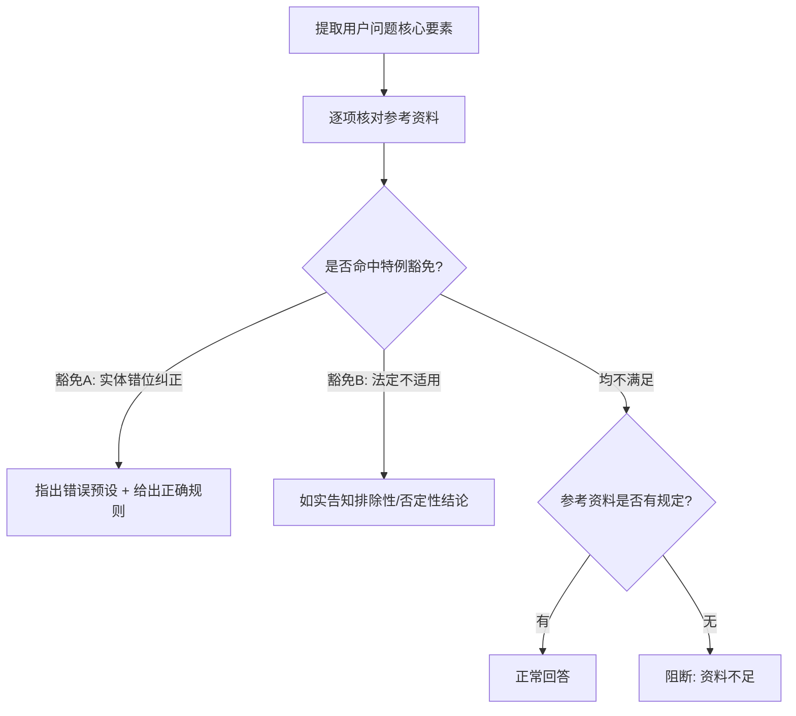

# 税务 RAG 智能问答系统

基于 RAG（检索增强生成）的企业级中国财税政策问答系统，支持三级置信度路由、实体边界检查、流式逐字输出和离线评测。

## 项目结构

```
├── rag_agent.py              # 核心：RAG 问答 Agent（三级路由 + 流式输出）
├── build_vector_db.py        # 向量库构建脚本（YAML 驱动，支持 txt/pdf）
├── web_demo.py               # Streamlit 可视化网页界面
├── debug_chunks.py           # 检索调试工具（逐 chunk 查看召回结果）
├── val_policy_qa.py          # 离线评测脚本（LLM-as-Judge 三维打分）
├── data_source.yaml          # 政策文件总索引（12 个条目，含元数据 + 原文 URL）
├── tax_synonyms.json         # 口语→法定术语同义词映射库（30+ 条映射）
├── tax law documents/        # 原始政策文件目录
│   ├── 中华人民共和国增值税法.txt           # 2026 年施行
│   ├── 中华人民共和国企业所得税法.pdf        # 2018 年修订版
│   ├── 中华人民共和国个人所得税法.pdf        # 2018 年修订版
│   ├── 中华人民共和国契税法.txt             # 2021 年施行
│   ├── 国发2018_41号_个税专项扣除暂行办法.txt
│   ├── 国发2023_13号_个税专项扣除.txt
│   ├── 财税2015_119号_研发加计扣除母法.txt
│   ├── 财税2018_64号_委托境外研发.txt
│   ├── 财税2023_7号_研发加计扣除现行比例.txt
│   ├── 财税2023_12号_小微所得税优惠.txt
│   ├── 财税2026_10号_小微增值税衔接.txt
│   └── test_questions.jsonl               # 50 条评测用例
├── chroma_db/                # 本地向量数据库（自动生成）
├── val_report.md             # 评测报告（Markdown 表格）
└── .gitignore
```

## 核心特性

### 1. 三级置信度路由

系统根据检索返回的 L2 distance 自动选择回答策略，杜绝低质量检索结果进入 LLM：

| 等级 | 阈值 (L2 distance) | 策略 | 回答行为 |
|------|-------------------|------|---------|
| ✅ HIGH | ≤ 0.85 | 完整 RAG + 零幻觉约束 | 基于资料库严谨回答，逐条引用出处 |
| 🟡 LOW | 0.85 ~ 1.10 | RAG + 风险警告 | 回答前强制输出匹配度低警告 |
| 🚫 NOHIT | > 1.10 | 阻断 LLM | 返回固定话术，零 Token 消耗 |

### 2. 实体边界检查（防幻觉防火墙）

在回答前强制执行四步实体核对：



**豁免 A — 实体错位纠正**：当用户"张冠李戴"时（如问"个体工商户如何缴纳企业所得税"），系统不会因找不到"个体户+企税"的联合规定而阻断，而是识别出概念错误并给出正确规则。

**豁免 B — 法定不适用**：资料中明确写了某主体"不适用/免征/不属于征收范围"，这本身就是一种法律规定，必须据此直接回答。

### 3. 查询扩展（零延迟）

通过 `tax_synonyms.json` 实现口语→法定术语的 O(1) 本地映射：

```
用户输入: "个体户的个税起征点是多少"
扩展后:   "个体户的个税起征点是多少 个体工商户 个人所得税 减除费用 基本减除费用 免征额"
```

不替换原词，仅追加法定术语，保留用户原始表达。

### 4. 流式逐字输出

绕过 LangChain 缓冲层，直接使用原生 HTTP SSE 流式调用 API，实现真实的逐 token 到达和精确的 TTFT（Time To First Token）测量。

### 5. 离线评测体系

`val_policy_qa.py` 实现完整的自动化评测：

- **评测维度**：相关性、引用准确率、幻觉控制（LLM-as-Judge 1-3 分制）+ 关键词命中 + NOHIT 阻断率
- **三级用例分类**：in-domain（库内常规题）、trap（陷阱题）、out-of-domain（库外拒答题）
- **性能测量**：TTFT（首字延迟）、P95 延迟、端到端总耗时

最新评测结果（20 题分层抽样，seed=42）：

| 指标 | 数值 | 说明 |
|------|------|------|
| 综合通过率 | 95.0% | 关键词 + 评委相关性≥2 双重校验 |
| 相关性平均分 | 3.00 / 3.00 | LLM-as-Judge |
| 引用准确率 | 2.83 / 3.00 | LLM-as-Judge |
| 幻觉率 | 0.0% | 核心指标：真实幻觉率（排除拒答） |
| NOHIT 阻断率 | 50.0% | out-of-domain 2 题，1 题正确拒答 |
| 关键词命中率 | 100.0% | 快速基准 |
| 平均 TTFT | 15.02s | 首字延迟 |
| P95 TTFT | 53.72s | 含个别慢题（q80 留学回国购车 53.7s） |

按题型拆分：

| 题型 | 数量 | 相关性 | 引用 | 通过率 | 平均 TTFT |
|------|------|--------|------|--------|-----------|
| in-domain | 13 | 3.00 | 2.85 | 100.0% | 15.07s |
| trap | 5 | 3.00 | 2.80 | 100.0% | 16.70s |
| out-of-domain | 2 | - | - | 50.0% | 10.55s |

## 快速开始

### 1. 安装依赖

```bash
pip install langchain langchain-core langchain-text-splitters
pip install langchain-huggingface langchain-chroma langchain-openai
pip install pymupdf pyyaml python-dotenv streamlit
```

### 2. 配置 API Key

创建 `.env` 文件：

```
INFINI_API_KEY=sk-your-key-here
```

### 3. 构建向量库

```bash
python build_vector_db.py
```

脚本会：
1. 读取 `data_source.yaml` 中的政策文件索引
2. 加载 `tax law documents/` 下的所有物理文件
3. 对法律文本进行排版恢复（缝合跨页断句、恢复段落结构）
4. 用 `RecursiveCharacterTextSplitter` 切分（chunk_size=1200, overlap=200）
5. 自动注入完整元数据（来源名称、文号、章节、条款、生效日期、原文 URL）
6. 存入 Chroma 向量数据库

### 4. 启动问答

**命令行交互模式：**
```bash
python rag_agent.py
```

**Streamlit 可视化界面：**
```bash
streamlit run web_demo.py
```

Web 界面特性：
- 类 ChatGPT 对话式 UI
- 置信度路由可视化（彩色标签）
- 检索来源透视（Top-6 来源 + distance + 元数据）
- 用户反馈日志：每条回答下方提供 👍/👎 按钮，点赞和点踩均会记录到 `data/feedback_logs.jsonl`，含用户态度标签（`thumbs_up` / `thumbs_down`）及完整对话上下文，用于后续分析
- 对话历史 + DST 状态持久化

### 5. 检索调试

```bash
# 使用默认问题
python debug_chunks.py

# 自定义问题
python debug_chunks.py "合伙企业是否需要缴纳企业所得税？"

# 指定召回数量
python debug_chunks.py -k 10 "研发费用加计扣除比例"
```

### 6. 运行评测

```bash
python val_policy_qa.py
```

输出 `val_results.json`（逐题详细 JSON）和 `val_report.md`（Markdown 汇总表格）。

## 添加新税法文件

### 步骤 1：放入原始文件

将新政策文件（支持 `.txt` 和 `.pdf` 格式）放入 `tax law documents/` 目录。

### 步骤 2：注册到 YAML 索引

在 `data_source.yaml` 中添加条目，支持两种字段命名风格：

**风格 A（推荐，语义清晰）：**
```yaml
- file_name: "财税2025_99号_新政策名称.txt"
  source_name: "关于XXX的公告"
  source_number: "财政部 税务总局公告2025年第99号"
  doc_type: "部门公告"
  date_published: "2025-06-01"
  date_effective: "2025-07-01"
  url: "https://www.gov.cn/..."
  topic: ["增值税", "税率"]
```

**风格 B（兼容旧格式）：**
```yaml
- file_name: "财税2025_99号_新政策名称.txt"
  policy_name: "关于XXX的公告"
  source: "财税〔2025〕99号"
  doc_type: "核心基准文件"
  date_published: "2025-06-01"
  date_effective: "2025-07-01"
  url: "https://www.gov.cn/..."
  applicable_scope: "界定新政策的适用范围"
```

`build_vector_db.py` 会自动进行字段归一化，两种风格混用也无妨。

### 步骤 3：重建向量库

```bash
python build_vector_db.py
```

脚本会自动清除旧库并重建全部索引。

## 扩展同义词库

编辑 `tax_synonyms.json`，按 `"口语词": ["法定术语1", "法定术语2"]` 格式添加映射：

```json
{
  "新口语词": ["法定术语A", "法定术语B"]
}
```

同义词用于查询扩展——不替换用户原始用词，仅追加法定术语以提高检索召回率。

## 评测用例管理

测试用例存储在 `tax law documents/test_questions.jsonl`，每行一个 JSON 对象：

```json
{
  "id": "q51",
  "type": "in-domain",
  "category": "企业所得税",
  "question": "小型微利企业的企业所得税优惠税率是多少？",
  "expected_keywords": ["20%", "小型微利企业", "减按"]
}
```

三种用例类型：
- **in-domain**：知识库应能精准回答的常规题
- **trap**：包含错误预设、易混淆概念的陷阱题
- **out-of-domain**：知识库未覆盖的领域外问题（验证阻断率）

## 技术栈

| 组件 | 技术选型 |
|------|---------|
| Embedding 模型 | `BAAI/bge-small-zh-v1.5`（HuggingFace，CPU） |
| 向量数据库 | Chroma（本地持久化，L2 距离度量） |
| 大语言模型 | DeepSeek-V4-Pro（通过 Infini-AI 兼容 API） |
| RAG 框架 | LangChain v1.x |
| PDF 解析 | PyMuPDF（fitz） |
| YAML 配置 | PyYAML |
| Web UI | Streamlit |
| 流式输出 | 原生 HTTP SSE（绕过 LangChain 缓冲层） |

## 设计原则

1. **幻觉零容忍**：严格的实体边界检查 + 三级置信度路由 + 禁止逻辑泛化
2. **可追溯性**：每个结论必须引用出处（`【来源：《政策名称》第X条】`）
3. **陷阱题友好**：识别用户概念错误并纠正，而非机械阻断
4. **性能优先**：检索阶段零 LLM 调用（< 50ms），流式输出 TTFT < 7.5s（平均）
5. **评测驱动**：50 题三级分类评测体系，持续追踪回答质量
